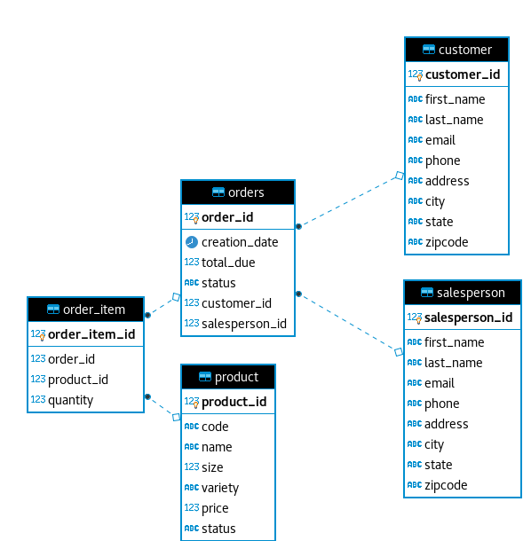

# JDBC Project 

## Introduction
JDBC allows a connection between a Java application and an RDBMS, such as PostgreSql. This app can create, update, read and delete (CRUD) data from PostgreSql database. By implementing this project, I have learnt about the concepts of Data Transfer Object(DTO), Data Access Object(DAO), and Repository design patterns, and how to build the connection between Java and RDBMS.\

### ER Diagram

## Instruction
The three arguments need to be specified in `Program arguments` in Intellij following the format:
```.*regex.* ./rootPath /outFile``` in order to search `.*regex.*` pattern from `./rootPath` directory recursively and output the result to `/rootPath` file.
In order to achieve the goal, the workflow is defined as below:

```
matchedLines = []
    for file in listFiles(rootDir)
     for line in readLines(file)
       if containsPattern(line)
        matchedLines.add(line)
writeToFile(matchedLines)
```

listFiles(): This method iterate a given directory, and return all the files.\
readLines(): It reads a file and return all the lines.
containsPattern(): It checks if a line contains the regex pattern, which is passed by user in `Program arguments`.\
writeToFile(): It writes matched lines to a output file.\
JavaGrep interface(JavaGrep.java) declares these methods.\
JavaGrepImp class(JavaGrepImp.java) implements JavaGrep interface.

## Performance Issue and Solutions
ListFiles() and readLines() methods leaverage collections data structure, and data resides in memory, so when processing large files, it will consume lots of memory resource. In order to overcome the drawback of collections, streams are introduced to override listFiles() and readLines() methods because stream is not a data structure that stores data; instead, it conveys elements from a source such as data structure through a pipeline of computational operations.

## Improvements
Grep App can add new feature such as counting the frequency of the regex in given directory.\
Grep App can add line numbers to each line to make it more user-friendly.
