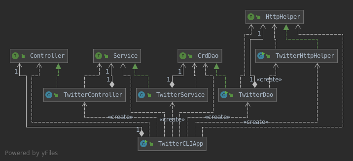
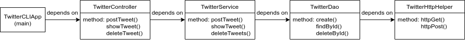

# TwitterCLI App 

## Introduction
TwitterCLI App aims to post, search, and delete Twitter posts by Twitter REST API. By completing this app, I get familiar with REST API, Twitter API, HTTP Client, JSON serializer/deserializer, JUnit & Mockito(testing) libraries, DTO, DAO, CRUD, MVC design patterns, and Spring Ioc, etc.



This app is similar to Linux command `egrep -r {regex} {rootPath} > {outFile}`.Java I/O and Lambda will be used in this app.
The app also takes above three arguments: regex, rootPath, outFile.
+ regex: a special text string for describing a search pattern
+ rootPath: root directory path
+ outFile: output file name

## Instruction
To post Twitter: "post" "tweet_text" "latitude:longitude"', e.g. "post" "Hello Twitter!" "20:20"\
To show Twitter: "show" "tweet_id" "field1, field2", e.g. "show" "1251952635629928448" "text,coordinates"\
To delete Twitter: "delete" "id", e.g."delete" "1251952635629928448"\

```
matchedLines = []
    for file in listFiles(rootDir)
     for line in readLines(file)
       if containsPattern(line)
        matchedLines.add(line)
writeToFile(matchedLines)
```

listFiles(): This method iterate a given directory, and return all the files.\
readLines(): It reads a file and return all the lines.
containsPattern(): It checks if a line contains the regex pattern, which is passed by user in `Program arguments`.\
writeToFile(): It writes matched lines to a output file.\
JavaGrep interface(JavaGrep.java) declares these methods.\
JavaGrepImp class(JavaGrepImp.java) implements JavaGrep interface.

## Performance Issue and Solutions
ListFiles() and readLines() methods leaverage collections data structure, and data resides in memory, so when processing large files, it will consume lots of memory resource. In order to overcome the drawback of collections, streams are introduced to override listFiles() and readLines() methods because stream is not a data structure that stores data; instead, it conveys elements from a source such as data structure through a pipeline of computational operations.

## Improvements
Grep App can add new feature such as counting the frequency of the regex in given directory.\
Grep App can add line numbers to each line to make it more user-friendly.

