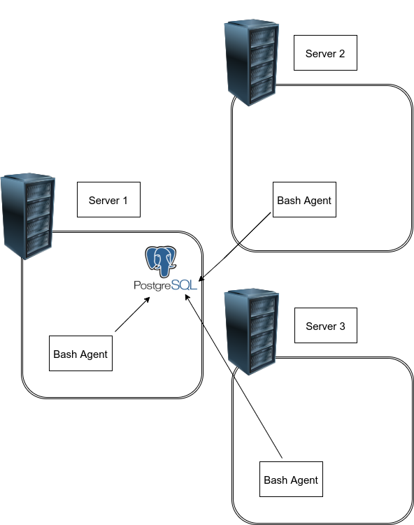

# Linux Cluster Monitoring Agent

## Introduction
Linux Cluster Monitoring Agent is a tool that aims to collect server hardware specifications and monitor node resource usages, such as CPU and Memory, and store all the data in Docker-provisioned PostgreSQL database. Linux Cluster Monitoring Agent allows administrators to efficiently track, analyze, diagnose, review data and repsond to any non-comformance.

## Architecture
Every node in Linux cluster runs Bash Agent, and the collected data is inserted into PostgreSQL database, which is installed in Node 1, as shown in the diagram below:
  

## Data Collection

The host_agent includes two tables, host_info and host_usage. host_info table stores server hardware specifications, and host_usage stores resource usages.
+ **host_info  table:** 
  id: unique id in each node, used as primary key of the table\
  hostname: hostname of the node\
  cpu_number: amount of cpu cores\
  cpu_model: cpu model\
  cpu_mhz: cpu performance\
  l2_cache: Level 2 cache, in kB\
  "timestamp": current time in UTC time zone\
  total_mem: memory size, in kB

## *The scripts description:*

+ **host_info.sh:** collects server hardware specifications and insert into database, and it is only run once when installing.
+ **host_usage.sh:** collect current host usage and insert into database, and crontab job will make it run every minute.
+ **psql_docker.sh:** starts,stops or delete psql container in Docker.

## *The sql description:*
 
+ **ddl.sql:** creates host_agent database if not exists, and create host_info and host_usage tables in this database. 
+ **queries.sql:** collects and process data that is stored in host_agent database for Linux Cluster Administration team.
 
 ## Instructions
  1. Creating PostgreSQL instance by creating and starting Docker container.You can also stop and delete it by
     specifying "stop" and "delete" option in  the following command:\
    `./scripts/psql_docker.sh start|stop|delete [db_password]`
    
  2. Initiallizing host_agent database and host_info, host_usage tables:\
    `psql -h localhost -U postgres -W -f sql/ddl.sql`
    
  3. Run host_info.sh only ONCE to collect hardware specifications and insert into host_info table:\
     `bash scripts/host_info.sh localhost 5432 host_agent postgres password`
     
  4. Run host_usage.sh to collect usage data and insert into host_usage table:\
    `bash scripts/host_usage.sh localhost 5432 host_agent postgres password`
    
  5. crontab job is used to trigger `host_uage.sh` every minute in order to collect usage data every minute:\
   `crontab -e`\
   `* * * * * bash /scripts/host_usage.sh localhost 5432 host_agent postgres password > /tmp/host_usage.log`
## Improvemetns
+ Add "delete" option in `./scripts/psql_docker.sh start|stop|delete [db_password]`\, so administrator can easily delete psql container easily.
+ The project can be more automated, so some steps can be run by one script.
+ An usage alert can be set up and inform administrator automaticaly 
