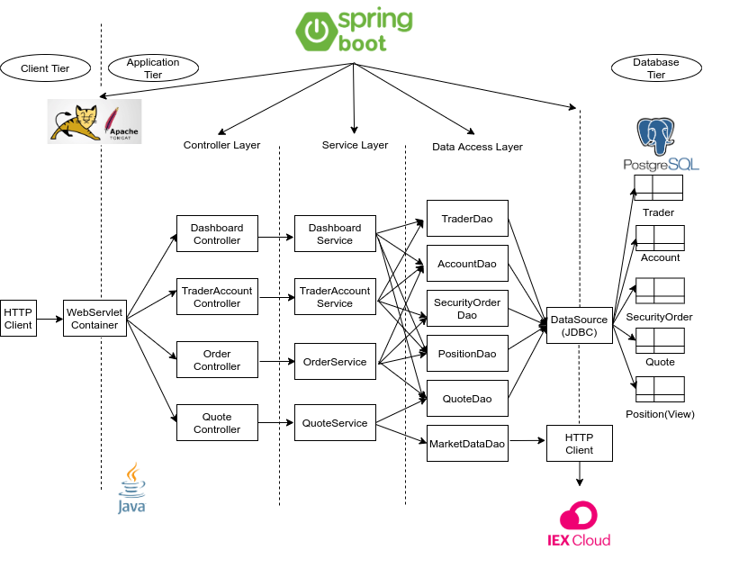
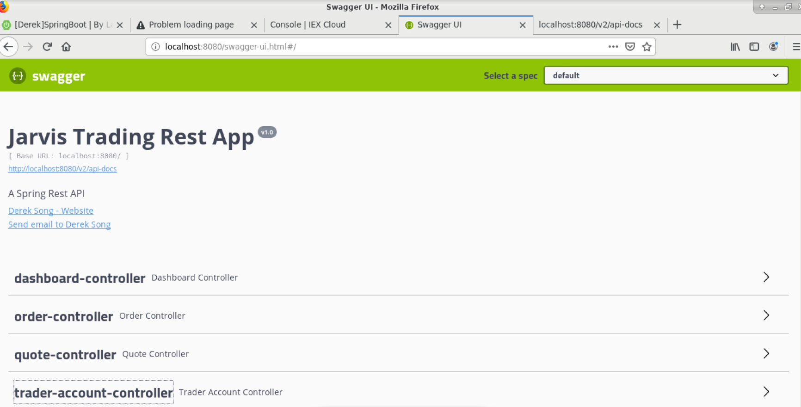
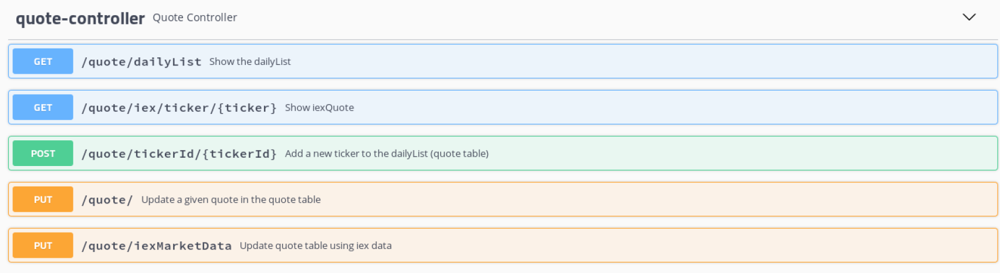
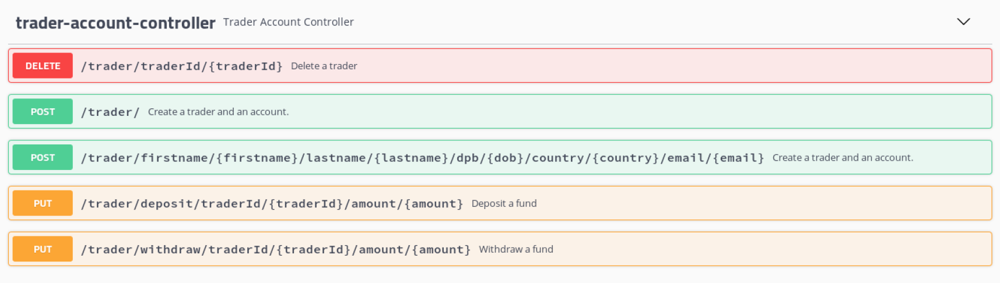
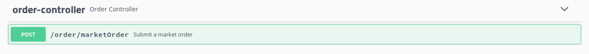
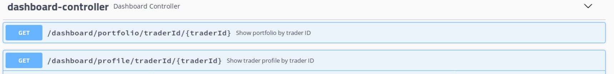
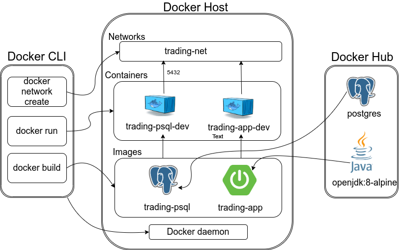

# Trading Application
* Introduction
* Quick Start
* Project Architecture
* Application Architecture
* REST API usage
* Docker Deployment
* Improvements

# Introduction
This application aims to develop an online stock trading REST API by using Microservice and MVC design architecture. This application extracts stock data from the IEX cloud, and stores the information into the PostgreSQL database to prevent data loss once the system crashes. Maven and SpringBoot are invoked to manage external and internal dependencies. Postman and Swagger are for testing Trading REST API during development.
# Quick Start
### System Requirements
Required system to deploy this application successfully:
- CentOS 7
- Docker (version 17.05 or higher)
- JDK (version 1.8)
- Maven
- Registration of an account on IEX cloud to get the API token

### Environmental Variables
Four environment variables are needed to run the application: 
```
PSQL_URL:It is the datasource URL of the PostgreSQL Database:
jdbc:postgresql://localhost:5432/jrvstrading 
PSQL_USER: It is user name when creating a database, and it is postgres.
PSQL_PASSWORD: It is password in this application. 
IEX_PUB_TOKEN: It is API token acquired from the IEX cloud.
```
### Docker setup 
+ Make sure docker version is `17.05 or higher`\
`docker -v`

+ Make sure docker is running by the following command:\
`systemctl status docker || systemctl start docker`
+ Create a docker network which allows docker containers to communicate with each other by the command:\
`docker network create --driver bridge trading-net`\
Verify\
`docker network ls`

+ Build docker image `trading-psql`. It is for PostgreSQL database which contains all market data and user information.\
`cd ./springboot/psql 
docker build -t trading-psql .
docker image ls -f reference=trading-psql`

+ Build docker image `trading-app`. It is based on `openjdk:8-alpine` and `maven:3.6-jdk-8-slim`.\
`cd ..
docker build -t trading-app . 
docker image ls -f reference=trading-app`

+ Build docker container `trading-psql-dev`\
```
# container for the Postgres SQL database and attach it to the created network`
`docker run --name trading-psql-dev \
`-e POSTGRES_PASSWORD=password \
`-e POSTGRES_DB=jrvstrading \
`-e POSTGRES_USER=postgres \
`--network trading-net \
`-d -p 5432:5432 trading-psql
```

+ Build docker container `trading-app-dev`\
`# container for the application and attach it to the created network`\
`docker run --name trading-app-dev \`\
`-e "PSQL_URL=jdbc:postgresql://trading-psql-dev:5432/jrvstrading" \`\
`-e "PSQL_USER=postgres" \`\
`-e "PSQL_PASSWORD=password" \`\
`-e "IEX_PUB_TOKEN=${IEX_PUB_TOKEN}" \`\
`--network trading-net \`\
`-p 5000:5000 -t trading-app`


# Project Architecture
\
As shown in the diagram above, this application consists of three tiers: Client Tier, Application Tier, and Database Tier.
+ Client Tier: Users can use HTTP clients to consume the REST (such as Swagger, Chrome, Postman, curl). Tomcat servlet will receive requests from HTTP clients, process requests, and send responses back to the HTTP client.
+ Application Tier: It is the Springboot Java program in this project. Application Tier processes data only, and it consists of three layers: Controller Layer, Service Layer, and Data Access Layer.
+ Database Tier: Application data is stored in a PostgreSQL database instance. The advantage of this tier is that if the Java application failed, the data stored in the database will still be persisted.

# Application Architecture
As stated above, the Application Tier also consists of three layers: Controller Layer, Service Layer, and Data Access Layer. 
+ Controller Layer: This layer contains the controller for each service, and is used to call corresponding methods in each service. There are four controllers: Dashboard Controller, TraderAccount Controller, OrderController, and QuoteController.
+ Service Layer: This layer handles the business logic and its methods are called by the corresponding controller. It includes Dashboard service, TraderAccount service, OrderService, and QuoteService.
+ Data Access Layer: This layer interacts with Database Tier and performs CRUD （create, read, update, and delete) operations. Besides, MarketDataDao can retrieve data from IEX Cloud. 

# REST API Usage

### Swagger UI and Postman
1. Swagger UI
Swagger is an open-source set of tools and helps developers to design, build, document, and consume REST APIs. It is automatically generated from OpenAPI specifications. To use Swagger UI, go to `http://localhost:8080/swagger-ui.html#/` on the host machine's web browser. It looks like the diagram below:

2. Postman
Postman can also be used to interact with Springboot application through HTTP requests. To use Postman, go to `http://localhost:8080/v2/api-docs`, save the page to the local machine, and import it to Postman.

### Quote Controller


__GET__ `/quote/dialyList`
- Return all tickers available on IEX cloud.

__GET__ `/quote/iex/ticker/{ticker}`
- Retrieve market data from the IEX cloud with the input ticker abd show IexQuote.

__POST__ `/quote/tickerId/{tickerId}`
- Add a new ticker to dailyList and save it to the database.

__PUT__ `/quote/`
- Update a specified quote in database

__PUT__ `/quote/iexMarketData`
- update quote talbe by using IEX data
### Trader Account Controller

__DELETE__ `/trader/traderId/{traderId}`
- delete a trader and the asscociatedd account. If the fund balance is not 0 or this trader is still holding securities, it will show error code.

__POST__ `/trader`
- create a trader and an associated account. All fields but the ID field should be non-null.

__POST__`/trader/firstname/{firstname}/lastname/{lastname}/dob/{dob}/country/{country}/email/{email}`
- create a trader and an associated account. All fields but the ID field should be non-null.The trader information is in the endpoint URL instead of the HTTP request header.

__PUT__`/trader/deposit/traderId/{traderId}/amount/{amount}`
- deposit the given amount of fund in a specified trader's account. If the given fund is less than zeor, it will show error.

__PUT__`/trader/withdraw/traderId/{traderId}/amount/{amount}`
- withdraw given amount of fund from the specified trader's account. If there is no enough balance in account, it will show error.
### Order controller

__POST__ `/order/marketOrder`
- execute a market order. If the size is positive, it is a buy order, and negative size means sell order.

### Dashboard controller

__GET__ `/dashboard/portfolio/traderId/{traderId}`
- show portfolio of specified traderId.

__GET__ `/dashboard/profile/traderId/{traderId}`
-  show trader profile of specified traderId.


# Docker Deployment


As mentioned before, the trading app and database need to be dockerized for deployment. The Trading App Docker diagram illustrates the process. First, trading-net, a docker network is created to allow Docker containers to communicate with each other. Second, it trading-psql docker image and trading-app docker image are created. The Dockerfile under `./psql/` directory is executed to initialize the database. The Dockerfile under `./springboot/` directory is executed to package the Java source using maven. Third, build containers from the images and attached them to the `trading-net` network.

# Improvements
+ Deploy the application on GCP
+ Allow transactions between traders
+ Allow multiple accounts under one trader's name
+ Generate a transaction statement for the trader monthly.
+ Show chart or graph of stock information so that traders can make better decisions.
